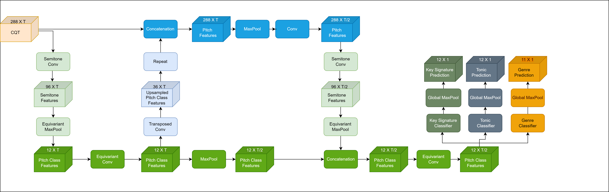
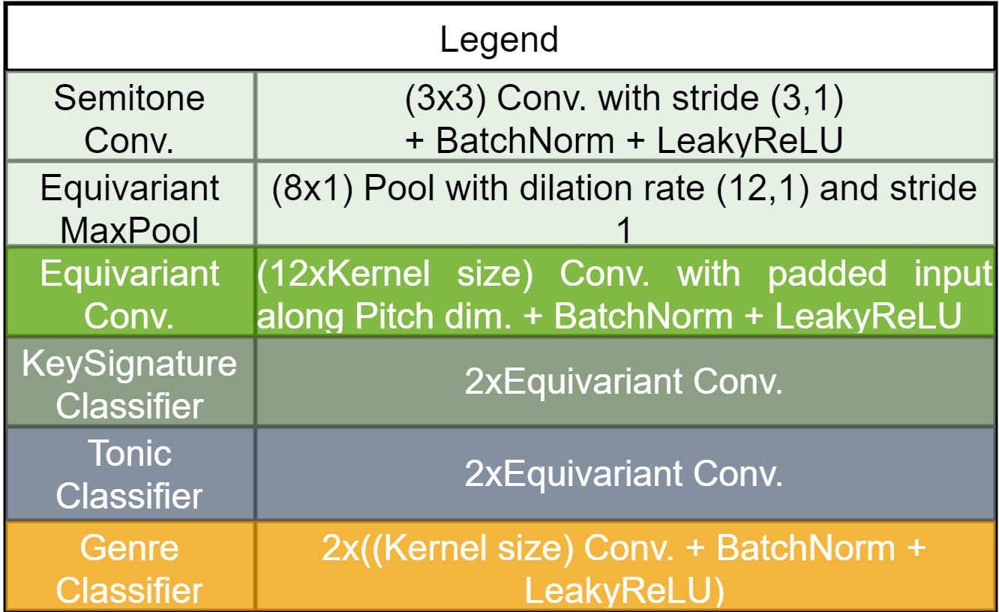

# Transposition Equivariant Music Key Signature Estimation 

## Introduction

This project is a global key signature estimation for audio files. It additionally predicts the tonic as well as the genre of a music piece. The final architecture is called PitchClassNet and is music transposition equivariant by design.

## Content

The project includes:
- Scraper tool that downloads audio files from Youtube and is also based on a similarity score to save only relevant matches
- Dataset classes for 14 different datasets + additional dataloaders
- Different PitchClassNet architectures
- training script
- fast model evaluation script
- Equivariance testing script to prove tranposition equivariance by design

## Setup & Datasets

This project makes use of the following datasets except FSL10K. The following table only shows the sample amounts used: 

<table>
    <col>
    <col>
    <col>
    <col>
    <tr>
        <th rowspan=1>Dataset</th>
        <th rowspan=1>Amount of Samples</th>
        <th rowspan=1>Genre Annotations</th>
        <th rowspan=1>Folder Locations</th>
        <th rowspan=1>Links</th>
    </tr>
    <tr>
        <td>Giantsteps MTG Key</td>
        <td>1486</td>
        <td>Yes</td>
        <td>Data/giantsteps-mtg-key-dataset</td>
        <td>https://www.upf.edu/web/mtg/giantsteps-key</td>
    </tr>
    <tr>
        <td>GiantSteps Key</td>
        <td>604</td>
        <td>Yes</td>
        <td>Data/giantsteps-key-dataset</td>
        <td>https://github.com/GiantSteps/giantsteps-key-dataset</td>
    </tr>
    <tr>
        <td>Tonality classicalDB</td>
        <td>342</td>
        <td>Yes</td>
        <td>Data/Tonality</td>
        <td>https://zenodo.org/record/4283868#.ZBCggnbMI2w</td>
    </tr>
    <tr>
        <td>Schubert - Winterreise</td>
        <td>48</td>
        <td>Yes</td>
        <td>Data/Schubert_Winterreise_Dataset_v1-1</td>
        <td>https://zenodo.org/record/4122060#.ZBCgV3bMI2y</td>
    </tr>
    <tr>
        <td>Isophonics - Queen</td>
        <td>19</td>
        <td>Yes</td>
        <td>Data/Queen_Isophonics</td>
        <td>http://isophonics.net/content/reference-annotations-queen</td>
    </tr>
    <tr>
        <td>Isophonics - Zweieck</td>
        <td>18</td>
        <td>Yes</td>
        <td>Data/Zweieck_Isophonics</td>
        <td>http://isophonics.net/content/reference-annotations-zweieck</td>
    </tr>
    <tr>
        <td>Isophonics - The Beatles</td>
        <td>177</td>
        <td>Yes</td>
        <td>Data/Beatles_Isophonics</td>
        <td>http://isophonics.net/content/reference-annotations-beatles</td>
    </tr>
    <tr>
        <td>Isophonics - King Carole</td>
        <td>7</td>
        <td>Yes</td>
        <td>Data/King_Carole_Isophonics</td>
        <td>http://isophonics.net/content/reference-annotations-carole-king</td>
    </tr>
    <tr>
        <td>GuitarSet</td>
        <td>360</td>
        <td>No</td>
        <td>Data/GuitarSet</td>
        <td>https://zenodo.org/record/3371780#.ZBCgmHbMI2w</td>
    </tr>
    <tr>
        <td>GTZAN</td>
        <td>837</td>
        <td>No</td>
        <td>Data/GTZAN</td>
        <td>https://www.kaggle.com/datasets/andradaolteanu/gtzan-dataset-music-genre-classification</td>
    </tr>
    <tr>
        <td>McGill Billboard</td>
        <td>734</td>
        <td>No</td>
        <td>Data/McGill-Billboard</td>
        <td>https://ddmal.music.mcgill.ca/research/The_McGill_Billboard_Project_(Chord_Analysis_Dataset)</td>
    </tr>
    <tr>
        <td>FSL10K</td>
        <td>9486</td>
        <td>No</td>
        <td>Data/FSL10K</td>
        <td>https://zenodo.org/record/3967852#.ZBCgu3bMI2w</td>
    </tr>
    <tr>
        <td>UltimateSongs</td>
        <td>25412</td>
        <td>Yes</td>
        <td>Data/UltimateSongs</td>
        <td>https://www.ultimate-guitar.com/</td>
    </tr>
    <tr>
        <td>KeyFinder</td>
        <td>841</td>
        <td>No</td>
        <td>Data/KeyFinder</td>
        <td>https://www.ibrahimshaath.co.uk/keyfinder/KeyFinderV2Dataset.pdf</td>
    </tr>

</table>

The following Code is compatible with PyTorch 1.8. Please create a new conda environment via running the following cell after cloning this repository:
<pre lang="shell">conda create --name <env> --file requirements.txt</pre>

Please, also make sure to store the Data in a folder called "Data" in the same main folder than contains this project e.g. main_folder/Audio-Key-Estimation -> main_folder/Data.

To download the data use the attached links to the datasets and if no audio files are contained use the youtube_scraper.py:
<pre lang="shell">python youtube_scraper --source <'song_list.txt'> --destination <'Dataset name'></pre>
Make sure to store the datasets in the same file locations as noted above for the respective datasets.

## Training & Evaluation

You can train your model via running the following command:
<pre lang="shell">python train_model.py --gpu <'GPU-NUMBER'></pre>

To evaluate a trained model, look up the lightning_logs version number of the specific model and run the following command:
<pre lang="shell">python eval.py --gpu <'GPU-NUMBER'> --version <'VERSION-NUMBER'></pre>
Note: Make sure that any architecture changes that deviate from default in train_model.py are also entered for eval.py.

When testing the architecture for transposition equivariance, just run the following command:
<pre lang="shell">python equivariance_test.py --gpu <'GPU-NUMBER'></pre>

For each of the scripts additional console commands exist which either change input dimensions, architecture designs, learning hyperparameters and so on. You can find the precise descriptions within the respective scripts.

## Architecture
The following figure displays the final model architecture:

## Results
The final results:
<table>
    <col>
    <col>
    <col>
    <tr>
        <th rowspan=1>Music Genre</th>
        <th rowspan=1>Dataset</th>
        <th rowspan=1>Mirex</th>
        <th rowspan=1>Key Signature Accuracy</th>
        <th rowspan=1>Tonic Accuracy</th>
        <th rowspan=1>Correct</th>
        <th rowspan=1>Fifths</th>
        <th rowspan=1>Parallel</th>
        <th rowspan=1>Relative</th>
        <th rowspan=1>Other</th>
    </tr>
    <tr>
        <td>Classical Music</td>
        <td>Winterreise</td>
        <td>86.25%</td>
        <td>83.33%</td>
        <td>95.83%</td>
        <td>79.17%</td>
        <td>8.33%</td>
        <td>8.33%</td>
        <td>4.17%</td>
        <td>0%</td>
    </tr>
    <tr>
        <td>Electronic</td>
        <td>Giantsteps Key</td>
        <td>73.15%</td>
        <td>74.67%</td>
        <td>74.67%</td>
        <td>66.72%</td>
        <td>5.30%</td>
        <td>6.95%%</td>
        <td>7.95%</td>
        <td>13.08%</td>
    </tr>
    <tr>
        <td>Rock/Pop</td>
        <td>Isophonics</td>
        <td>68.64%</td>
        <td>66.97%</td>
        <td>79.64%</td>
        <td>61.54%</td>
        <td>5.43%</td>
        <td>15.84%</td>
        <td>4.07%</td>
        <td>13.12%</td>
    </tr>

</table>

